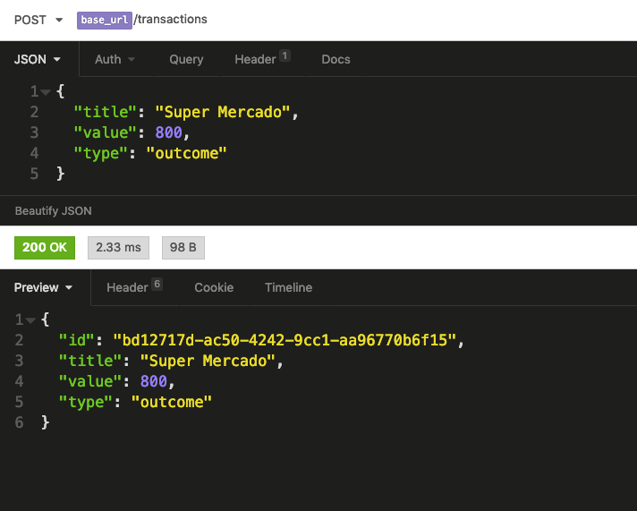
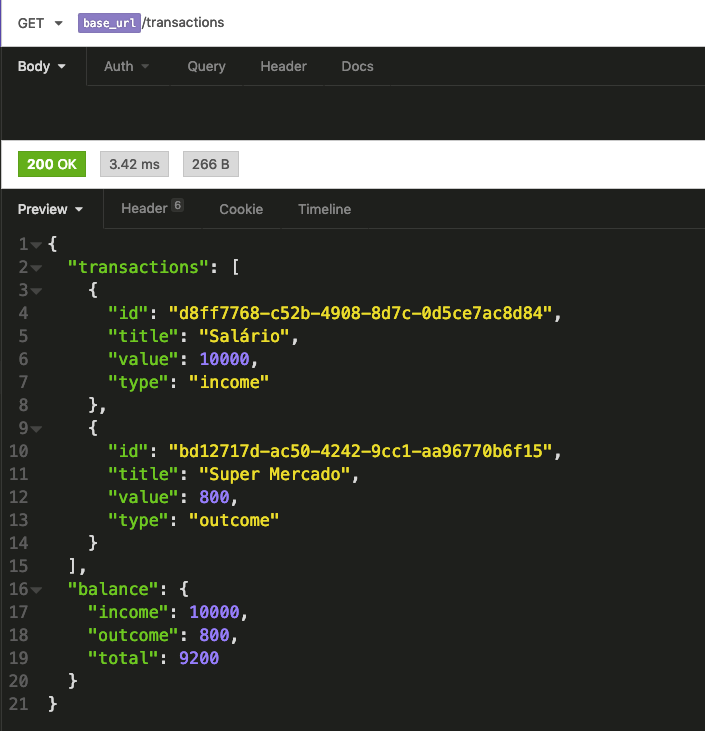

<h1 align="center">
    
</h1>

<h3 align="center">
  Desafio sobre Fundamentos de Node JS aplicado no Bootcamp GoStack
</h3>

<p align="center">
  <a href="#rocket-sobre-a-aplicação">Sobre a Aplicação</a>&nbsp;&nbsp;&nbsp;|&nbsp;&nbsp;&nbsp;
  <a href="#conteúdo-abordado">Conteúdo Abordado</a>&nbsp;&nbsp;&nbsp;|&nbsp;&nbsp;&nbsp;
  <a href="#instalação">Instalação</a>&nbsp;&nbsp;&nbsp;|&nbsp;&nbsp;&nbsp;
  <a href="#executando-a-aplicação">Executando a Aplicação</a>&nbsp;&nbsp;&nbsp;|&nbsp;&nbsp;&nbsp;
  <a href="#executando-os-testes-da-aplicação">Executando os Testes da Aplicação</a>&nbsp;&nbsp;&nbsp;|&nbsp;&nbsp;&nbsp;
  <a href="#rotas-da-aplicação">Rotas da aplicação</a>&nbsp;&nbsp;&nbsp;|&nbsp;&nbsp;&nbsp;
  <a href="#exemplos-de-uso-no-insomnia">Exemplos de Uso no Insomnia</a>&nbsp;&nbsp;&nbsp;|&nbsp;&nbsp;&nbsp;
  <a href="#memo-licença">Licença</a>
</p>

## :rocket: Sobre a Aplicação

Essa é uma aplicação para que deve armazenar transações financeiras de entrada e saída, que deve permitir o cadastro e a listagem dessas transações.

## Conteúdo Abordado

- Configurando estrutura;
- EditorConfig;
- ESLint;
- Importando arquivos TS;
- Prettier;
- Debugando NodeJS;
- Services & SOLID.

## Instalação

Instalação das dependências do projeto.

```sh
# Com NPM
npm install

# Com Yarn
yarn
```

## Executando a Aplicação

```sh
# Com NPM
npm run dev:server

# Com Yarn
yarn dev:server
```

## Executando os Testes da Aplicação

```sh
# Com NPM
npm run test

# Com Yarn
yarn test
```

## Rotas da aplicação

- `POST /transactions`: A rota recebe `title`, `value` e `type` dentro do corpo da requisição, sendo type o tipo da transação, que deve ser `income` para entradas (depósitos) e `outcome` para saidas (retiradas);

- `GET /transactions`: Essa rota retorna uma listagem com todas as transações que você cadastrou até agora, junto com o valor de soma de entradas, retiradas e total de crédito;

## Exemplos de Uso no Insomnia

### Criando uma Transação



### Listando Transações



## :memo: Licença

Esse projeto está sob a licença MIT. Veja o arquivo [LICENSE](LICENSE.md) para mais detalhes.
